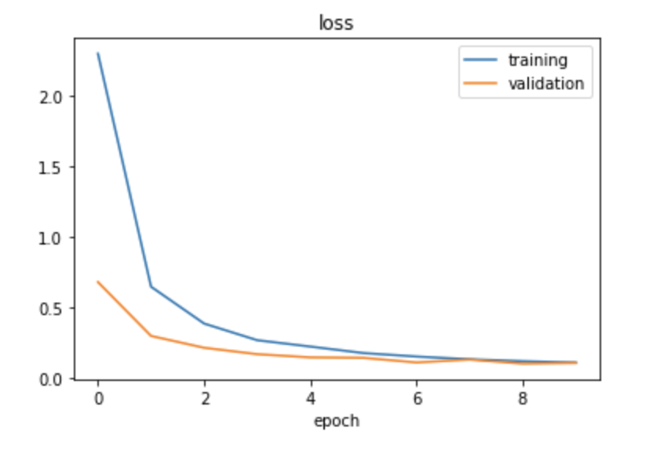
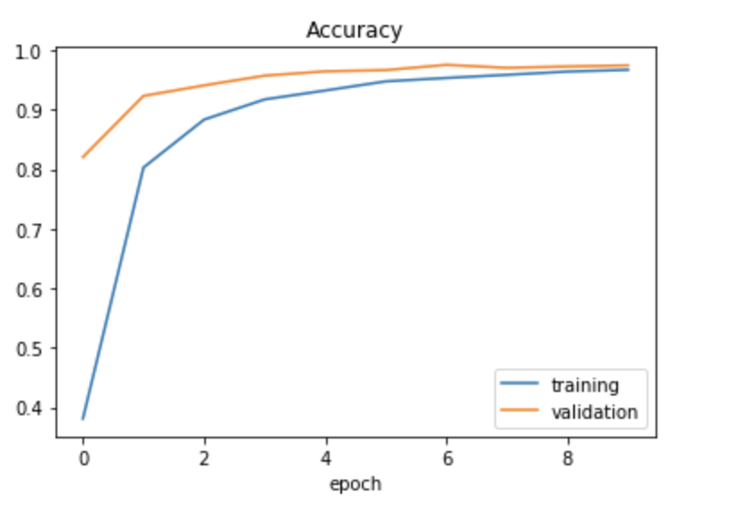
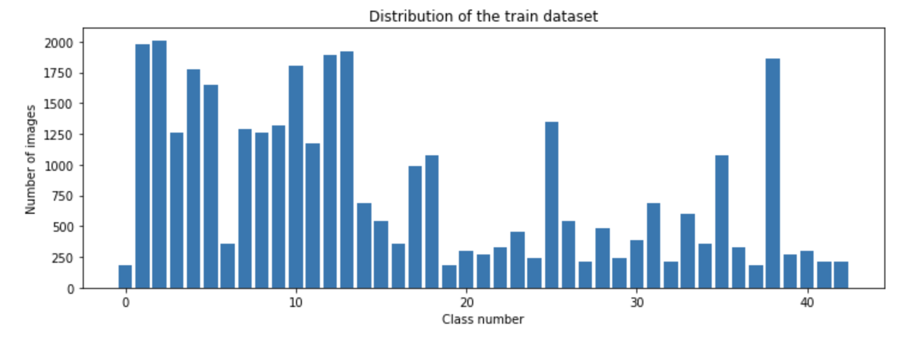
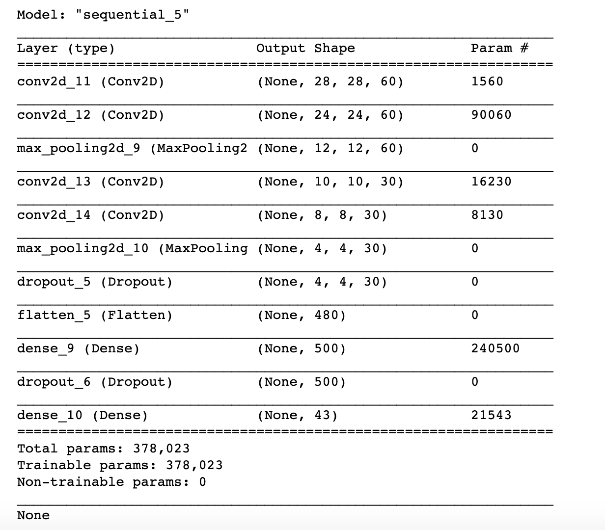
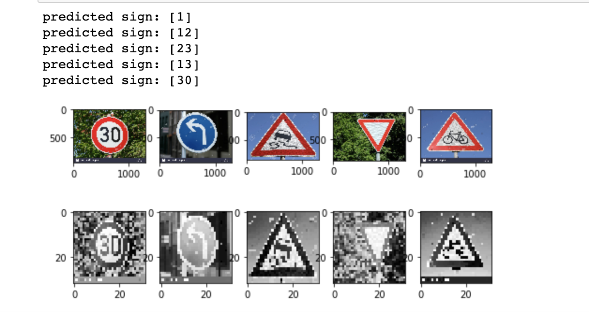

# **Traffic Sign Recognition Classifier** 

## Overview

#### In this project, you will use what you've learned about deep neural networks and convolutional neural networks to classify traffic signs. You will train a model so it can decode traffic signs from natural images by using the German Traffic Sign Dataset. After the model is trained, you will then test your model program on new images of traffic signs you've found. 
---

## Build a Traffic Sign Recognition Project**

### Step 0: Load the data
#### load data "german-traffic-signs"
```python
!git clone https://bitbucket.org/jadslim/german-traffic-signs.git
!ls german-traffic-signs
```
#### get data shape.
```
output
X_train shape: (34799, 32, 32, 3)
y_train shape: (34799,)
X_valid shape: (34799, 32, 32, 3)
y_valid shape: (34799,)
X_test shape: (12630, 32, 32, 3)
y_test shape: (12630,)
```
### Step 1: Dataset Summary & Exploration
#### Using Pandas to provide a Basic Summary of the Data Set
```python
output
Number of training examples = 34799
Number of validation examples = 4410
Number of testing examples = 12630
Image data shape = (32, 32, 3)
Number of classes = 43
```
### Using Matplotlib to show visualization of the dataset


### Step 2: Design and Test a Model Architecture
#### Pre-process the Data Set
```python
# show image
import cv2
plt.imshow(X_train[1000])

# convert image to grayscale
def grayscale(img):
    img = cv2.cvtColor(img,cv2.COLOR_BGR2GRAY)
    return img

img = grayscale(X_train[1000]) 

# histogram equalization helps image into same bright
def equalize(img):
    img = cv2.equalizeHist(img)
    return img
img = equalize(img)

# preprocessing data
def preprocessing(img):
    img = grayscale(img)
    img = equalize(img)
    img = img/255      #normalize
    return img
```
#### Train, Validate and Test the Model
```python
# Add the depth our data in the desired shape to be used as input in CNN
X_train = X_train.reshape(34799, 32, 32,1)
X_test = X_test.reshape(12630, 32, 32,1)
X_valid = X_valid.reshape(4410, 32, 32,1)

# Create leNet model
def leNet_model():
    model = Sequential()
    model.add(Conv2D(60,(5,5),input_shape=(32,32,1),activation = 'relu'))
    model.add(MaxPooling2D(pool_size = (2,2)))   
    model.add(Conv2D(30,(3,3),activation = 'relu'))    
    model.add(MaxPooling2D(pool_size = (2,2)))
    model.add(Flatten())
    model.add(Dense(500,activation = 'relu'))
    model.add(Dropout(0.5))
    model.add(Dense(num_classes,activation = 'softmax'))
    model.compile(Adam(lr = 0.001), loss = "categorical_crossentropy", metrics = ['accuracy'])
    return model
```

#### Modify the Model 
```python
def modified2_model():
    model = Sequential()
    model.add(Conv2D(60,(5,5),input_shape=(32,32,1),activation = 'relu'))
    model.add(Conv2D(60,(5,5),activation = 'relu'))
    model.add(MaxPooling2D(pool_size = (2,2)))
    
    model.add(Conv2D(30,(3,3),activation = 'relu'))
    model.add(Conv2D(30,(3,3),activation = 'relu'))
    model.add(MaxPooling2D(pool_size = (2,2)))
    model.add(Dropout(0.5))
    
    model.add(Flatten())
    model.add(Dense(500,activation = 'relu'))
    model.add(Dropout(0.5))
    model.add(Dense(num_classes,activation = 'softmax'))
    model.compile(Adam(lr = 0.001), loss = "categorical_crossentropy", metrics = ['accuracy'])
    return model 
```    




### Data Set Summary & Exploration

#### 1. Provide a basic summary of the data set. 

* The size of training set = 34799
* The size of the validation set = 4410
* The size of test set = 12630
* The shape of a traffic sign image = (32, 32, 3)
* The number of unique classes/labels in the data set = 43

#### 2. Include an exploratory visualization of the dataset.



### Design and Test a Model Architecture

#### 1. Describe how you preprocessed the image data. What techniques were chosen and why did you choose these techniques? 

1) convert the images to grayscale to avoid noise.
2) histogram equalization helps image into same bright.

#### 2. Describe what your final model architecture looks like including model type, layers, layer sizes, connectivity, etc.)

My final model consisted of the following layers:


#### 3. Describe how you trained your model. The discussion can include the type of optimizer, the batch size, number of epochs and any hyperparameters such as learning rate.
```  
lr = 0.001
batch_size = 400
epochs = 10

> accuracy = 0.943
```  
#### 4. Describe the approach taken for finding a solution and getting the validation set accuracy to be at least 0.93. Include in the discussion the results on the training, validation and test sets and where in the code these were calculated.

##### Two issues: 1. Accuracy is not high. 2. Overfitting
###### Improve accuracy
* Version 1: lr = 0.01, accuracy = 0.865
* Version 2: lr = 0.001, accuracy = 0.913
* Version 3: increasing the number of filters inside convolutional layer help network extract more features, accuracy = 0.926
```python
    model.add(Conv2D(60,(5,5),input_shape=(32,32,1),activation = 'relu'))
    model.add(Conv2D(30,(3,3),activation = 'relu'))
```
* Version 4: add two more layers in our nerual network. accuracy = 0.943
```python
    model.add(Conv2D(60,(5,5),activation = 'relu'))
    model.add(Conv2D(30,(3,3),activation = 'relu'))
```
###### Solve overfitting
* Version 5: Add another dropout layer. accuracy = 0.961
```python
model.add(Dropout(0.5))
```

My final model results were:
* training set accuracy = 0.967
* validation set accuracy = 0.974
* test set accuracy = 0.961

 
### Test a Model on New Images

#### 1. Choose five German traffic signs found on the web and provide them in the report. For each image, discuss what quality or qualities might be difficult to classify.

Here are five German traffic signs that I found on the web:
```python
url = ["https://c8.alamy.com/comp/G667W0/road-sign-speed-limit-30-kmh-zone-passau-bavaria-germany-G667W0.jpg",
       "https://c8.alamy.com/comp/A0RX23/cars-and-automobiles-must-turn-left-ahead-sign-A0RX23.jpg",
       "https://previews.123rf.com/images/bwylezich/bwylezich1608/bwylezich160800375/64914157-german-road-sign-slippery-road.jpg",
       "https://previews.123rf.com/images/pejo/pejo0907/pejo090700003/5155701-german-traffic-sign-no-205-give-way.jpg",
       "https://c8.alamy.com/comp/J2MRAJ/german-road-sign-bicycles-crossing-J2MRAJ.jpg"
      ]
```

#### 2. Discuss the model's predictions on these new traffic signs and compare the results to predicting on the test set. At a minimum, discuss what the predictions were, the accuracy on these new predictions, and compare the accuracy to the accuracy on the test set (OPTIONAL: Discuss the results in more detail as described in the "Stand Out Suggestions" part of the rubric).

Here are the results of the prediction:




The model was able to correctly guess 4 of the 5 traffic signs, which gives an accuracy of 80%. This compares favorably to the accuracy on the test set of ...

We can correctly guess 3 of the 5 traffic signs. only 60% accuracy. 

##### This is not enough!!!

#### 3. Describe how certain the model is when predicting on each of the five new images by looking at the softmax probabilities for each prediction. Provide the top 5 softmax probabilities for each image along with the sign type of each probability. 


### (Optional) Visualizing the Neural Network (See Step 4 of the Ipython notebook for more details)
#### 1. Discuss the visual output of your trained network's feature maps. What characteristics did the neural network use to make classifications?

